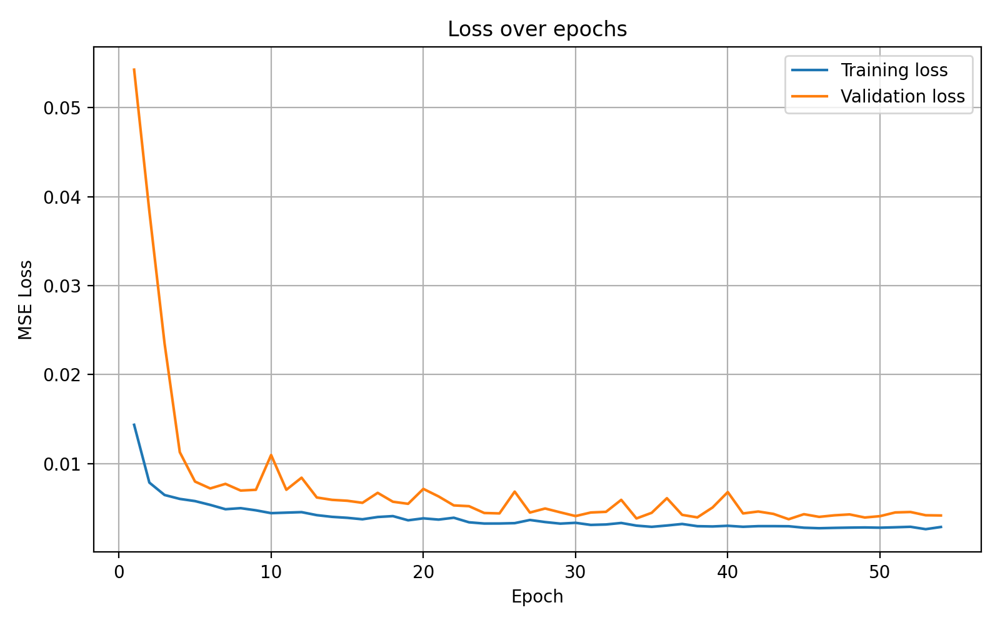
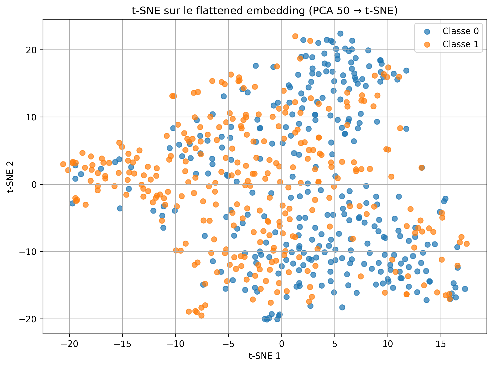

# Convolutional autoencoder for representation learning (shark vs dolphin)

A convolutional autoencoder, trained without labels on shark and dolphin images, whose encoder is then reused as a feature extractor. The quality of the learned representation is measured with a linear SVM probe, and the embedding space is visualised with t-SNE. Coursework for INF7370 (Machine Learning) at UQAM, Fall 2025.

> **Result:** the autoencoder reaches a validation reconstruction MSE of **0.0038**. A linear SVM trained on its features gets **64.8 % ± 4.2** (5-fold CV) versus **59.2 %** for the same SVM on raw pixels, a gain of **+5.6 points** from unsupervised features alone.

## Results

**Reconstruction**

| Metric | Value |
|---|---|
| Min training MSE | 0.00263 |
| Min validation MSE | **0.00375** (epoch 44) |
| Validation MSE of the first 2-block version | ≈ 0.005 |
| Training time | 11.4 min (Colab GPU) |

<p align="center">
  
</p>
<p align="center">
  <br/>
  <sub>Left to right: dolphin (original, reconstruction) and shark (original, reconstruction). The global structure is kept and fine textures are smoothed out.</sub>
</p>

**Linear probe (600 test images, 5-fold CV)**

| Input features | Classifier | Accuracy |
|---|---|---|
| Raw pixels | Linear SVM (grid-searched C) | 0.592 |
| **Autoencoder features → StandardScaler → PCA(256)** | Linear SVM | **0.648 ± 0.042** |

<p align="center">
  
</p>

In the t-SNE plot the two classes separate partially but visibly. Sharks and dolphins share shape, colour and background (open water), so a linear boundary on unsupervised features stays hard to draw.

## Method

**Data.** 1,800 images per class, split 80/20 (2,880 for training, 720 for validation), plus 600 test images. Images are resized to 128×128 RGB. Light augmentation is applied to training only: rotation ±10°, shifts of 5 %, zoom 10 % and horizontal flip.

**Architecture.** The encoder and decoder are symmetric. The bottleneck is a 16×16×128 tensor.

```
Encoder: 3 × [ (Conv 3×3 → BN → ReLU) × 2 → MaxPool 2×2 ]   32 → 64 → 128 filters, Dropout 0.10 / 0.15
Decoder: 3 × [ (Conv 3×3 → BN → ReLU) × 2 → UpSampling 2×2 ] 128 → 64 → 32 filters
Output : Conv(3, 3×3) → Sigmoid   (128×128×3)
```

**Training.** MSE loss, Adam with learning rate 1e-3, batch size 32, and up to 60 epochs with early stopping (patience 10). Going from 2 blocks to 3, together with BatchNorm, light dropout and augmentation, cut the validation MSE from about 0.005 to 0.0038.

## Known issue & v2 roadmap
- **Probe layer.** The evaluation script takes the features at `layers[6]`, with shape 128×128×32, instead of the 16×16×128 bottleneck named `embedding`. The 64.8 % figure therefore measures early convolutional features, not the latent code. **Next step:** re-extract with `autoencoder.get_layer("embedding")` and re-run the probe.
- The next thing to try is a supervised signal on the latent space, such as a joint classification head or a contrastive objective (SimCLR-style). A VAE could also give a smoother latent space.
- For a fair comparison, run the pixel baseline with the same PCA(256) pipeline and report both over several seeds.

## Reproduce

```bash
pip install tensorflow scikit-learn matplotlib
python 1_Modele_TP3.py        # trains the autoencoder and saves Model.keras
python 2_Evaluation_TP3.py    # reconstructions, SVM probe, t-SNE
```

Full report (FR): [`rapport_TP3_JALLAIS.pdf`](./rapport_TP3_JALLAIS.pdf)

**Stack:** Python · TensorFlow/Keras · scikit-learn (SVM, PCA, t-SNE) · Matplotlib
